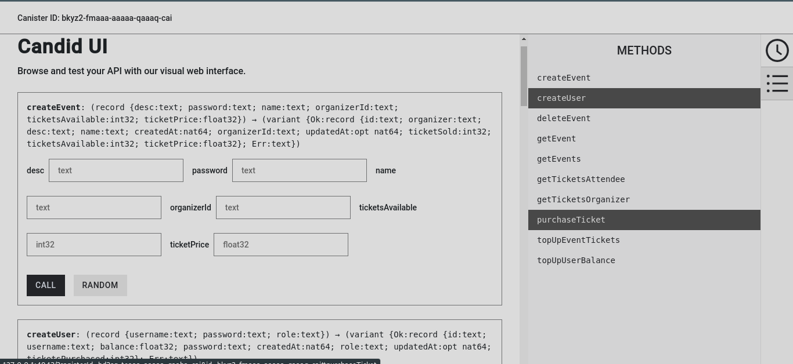

# Event Manager ICP Canister Smart Contract

This is a Proof of Concept (PoC) **ICP** Canister Smart-Contract built using TypeScript and Node.js on top of the Azle framework that
also doubles as my submission to the [Internet Computer TypeScript Smart Contract 101](https://dacade.org/communities/icp/courses/typescript-smart-contract-101)
course.

This smart contract allows users (**organizer**s) to create events and other users (**attendee**s) to
purchase tickets for the events.

Functions available for interacting with the smart contract include:

- **createUser** -- userId and password protected
- **topUpUserBalance** -- userId and password protected
- **createEvent** -- userId and password protected
- **deleteEvent** -- userId and password protected
- **getEvents**
- **getEvent** -- userId and password protected
- **topUpEventTickets** -- userId and password protected
- **purchaseTicket** -- userId and password protected
- **getTicketsAttendee** -- userId and password protected
- **getTicketsOrganizer** -- userId and password protected

## Interacting with the Canister

Please refer to this [section]() to set up your command execution environment with **dfx** and install Node.js.

With those taken care of, please follow the steps below to run and interact with the canister.

1. Clone this repository to your local machine.
2. In the directory where you cloned this repository to, run `npm install` to install all dependencies.
3. After installation, run the following in order:

   - `npm run start`
   - `npm run deploy`

4. Follow the Link to open the Candid UI in your web browser.

Below is a screenshot of what the Candid UI looks like.

## Contributing

Found a bug or thought of a neat feature to add? Please fork the repo and open a pull request!
